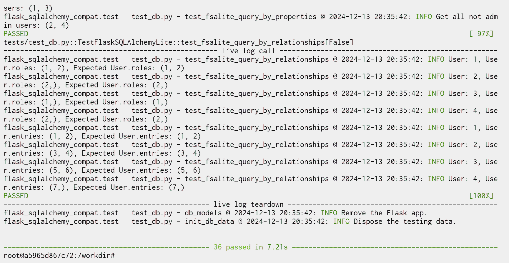
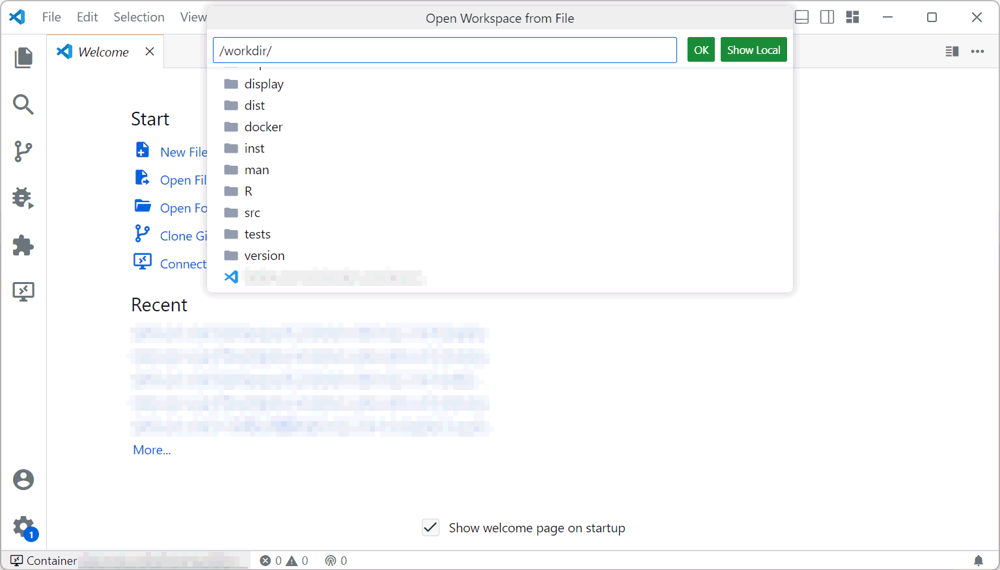

# Flask SQLAlchemy Compat

## CONTRIBUTING

This guide shows how to compile and test this project. Anyone who want to contribute to these codes can follow this guide and submit the pull request. [Section 2 :bookmark:](#2-work-with-docker) and [Section 3 :bookmark:](#3-work-with-conda) suggests how to work with Docker or Conda, respectively. Please choose either of these tools to deploy the environment and develop this project.

> [!CAUTION]
> We strongly suggest users to prepare the environment by Docker (see [2.1. :bookmark:](#21-install-by-docker)).
> Docker is supported by both Linux and Windows. Using Docker can save a lot of steps and mitigate issues caused by the path.

### 1. Explanations for the source codes

* Review our [code of conduct :memo:](./CODE_OF_CONDUCT.md) before contributing to this project.

* The metadata of the project is defined in `pyproject.toml`. Some metadata are dynamically solved from the other files, like the package version. Therefore, users need to ensure changes are done in the correct places if any part of the metadata needs to be changed.

* The Python codes are in the package `flask_sqlalchemy_compat/` folder. These codes are formatted by [`black`:hammer:][tool-black]. Note that the automatically generated files (may be introduced in the future) will not be formatted.

* The extra demos are stored in `examples/`. These demos show the usages this package in different cases.

* The unit tests are defined in the `tests/` folder.

* The `version/` folder is only used for helping `pyproject.toml` fetch the current version.

* The tool configurations for `pytest`, `black`, and `pyright` are defined in `pyproject.toml`. However, the configurations for `flake8` and `pylint` are still kept in their corresponding configurations files.

* Remember to use [`black`:hammer:][tool-black] to format any modified Python codes. Review your code before sending the pull request.

### 2. Work with Docker

#### 2.1. Install by Docker

If you choose to use Docker. The only software you need to install is `docker` itself. Check the following guide to install Docker on your device:

https://docs.docker.com/get-started/get-docker/

After installing docker, test whether it works or not by

``` sh
docker run -it --rm hello-world
```

You should be able to see the message like this, which shows that `docker` is working well:


Then, build the docker image by

``` sh
docker build -t flask-sqlalchemy-compat:latest https://github.com/cainmagi/flask-sqlalchemy-compat.git
```

This step may take a little bit long. After successfully building the image, you can start working on this project.

#### 2.2. Test the codes

Run the following command to start the tests.

``` sh
docker run -it --rm flask-sqlalchemy-compat:latest
```

<!--
If the codes have not been modified, you suppose to see the the messages like this:



It shows that all unit tests get passed.
-->

#### 2.3. Run the demo

> [!CAUTION]
> The demo is not ready now. Check the future version to find the demo.

We have prepared several demos. Run this command to launch the default demo:

``` sh
docker run -it --rm -p 8080:8080 flask-sqlalchemy-compat:latest --demo
```

The following command is used for launching a different demo. The available demo names are the `.py` file names in `./examples`

``` sh
docker run -it --rm -p 8080:8080 flask-sqlalchemy-compat:latest --demo demo=app_fsqla
```

|    Demo Name     | Description                                                          |
| :--------------: | -------------------------------------------------------------------- |
|    `default`     | Only run some Flask SQLAlchemy (Lite) commits and queries.           |
|   `app_fsqla`    | A Flask application providing APIs powered by Flask SQLAlchemy.      |
| `app_fsqla_lite` | A Flask application providing APIs powered by Flask SQLAlchemy Lite. |

When the demo is running, you should be able to access the demo by

http://localhost:8080/

#### 2.4. Develop the project

To modify the scripts, you may want to clone an Git repository by yourself:

``` sh
git clone https://github.com/cainmagi/flask-sqlalchemy-compat
```

Then, you can run the docker container and mount the newly cloned Git folder to the container:

``` sh
docker run -it --rm -v <path-to-the-project>:/workdir -p 8080:8080 flask-sqlalchemy-compat:latest --bash
```

When the container is running, you should be able to see that your are in the container's console.

Please leave the container open, and follow this guide to **attach your vscode to the running container**:

https://code.visualstudio.com/docs/devcontainers/attach-container



At the **bottom left** corner, you should be able to see the name of the current container. When you open a new workspace, you should be able to find the the project in `/workdir`.

Now you will be able to start the development. You can do the following things to test the codes.

* Run the `pytest`:

    ``` sh
    python -m pytest
    ```

* Format the python codes
  
    ``` sh
    black .
    ```

* Run an example
  
    ``` sh
    python -m examples.app_fsqla
    ```

* Build the python pacakge
  
    ``` sh
    python -m build
    ```

Before submitting a pull request, please ensure that all unit tests (`pytest`) get passed and the codes are formatted by `black`.

### 3. Work with Conda

> [!CAUTION]
> This method is not recommended because `conda` may take redundant space to install unnecessary pacakges. Users need to maintain the dependencies by themselves.

Before start the installation, you need to ensure the following things are installed:

* Conda or Mamba
  
    Either MiniConda or MicroMamba is a good option. MicroMamba is even faster than MiniConda. If you choose to use micromamba, you simply need to replace `conda` by `micromamba` in any command.

    * Get MiniConda: https://docs.anaconda.com/miniconda/miniconda-install/
    * Get MicroMamba: https://mamba.readthedocs.io/en/latest/installation/micromamba-installation.html

* A browser

    You need to ensure that either one of the Chromium-based browser is installed.

    * Get Edge: https://www.microsoft.com/en-us/edge/download
    * Get Chrome: https://www.google.com/chrome/dr/download
    * Get Chromium: https://www.chromium.org/getting-involved/download-chromium/

* Git

    You need to ensure that Git command is available:

    * Get Git: https://git-scm.com/downloads

#### 3.1. Get the source codes

Use Git to clone the latest source codes:

``` sh
git clone https://github.com/cainmagi/flask-sqlalchemy-compat
```

#### 3.2. Prepare the dependencies

The following steps will help you configure the environment with `conda`:

1. Create the environment

    ``` sh
    conda create -c conda-forge -n flaskdev-fsc python=3.12 wheel setuptools
    ```

2. Enter the environment

    ``` sh
    conda activate flaskdev-fsc
    ```

3. Install the Python dependencies

    ``` sh
    pip install -r requirements.txt -r requirements-dev.txt -r tests/requirements.txt
    ```

#### 3.3. Run the test

To verify whether you have correctly prepared the environment or not, you can run the following command:

``` sh
python -m pytest
```

#### 3.4. Develop the project

You can do the following things to test the codes.

* Run the `pytest`:

    ``` sh
    python -m pytest
    ```

* Format the python codes
  
    ``` sh
    black .
    ```

* Run an example
  
    ``` sh
    python -m examples.app_fsqla
    ```

* Build the python pacakge
  
    ``` sh
    python -m build
    ```

Before submitting a pull request, please ensure that all unit tests (`pytest`) get passed and the codes are formatted by `black`.

[tool-black]:https://marketplace.visualstudio.com/items?itemName=ms-python.black-formatter
[tool-prettier]:https://marketplace.visualstudio.com/items?itemName=ms-python.black-formatter
